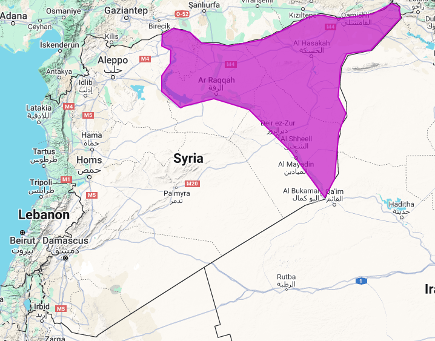
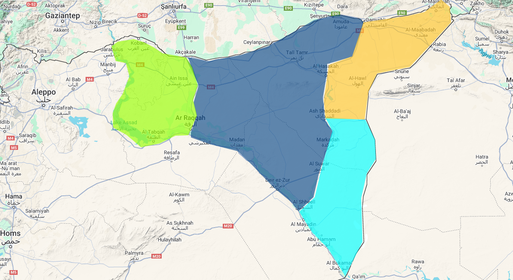

# Data Collection process 


## Index
- [Data Collection process](#data-collection-process)
  - [Index](#index)
  - [Introduction](#introduction)
  - [Targeted data](#targeted-data)
  - [Targeted areas](#targeted-areas)
    - [Table of AOI , Sectors and Subsectors](#table-of-aoi--sectors-and-subsectors)
    - [Images from Google earth engine on the Areas](#images-from-google-earth-engine-on-the-areas)
      - [Area of interest (AOI)](#area-of-interest-aoi)
      - [Sectors](#sectors)
      - [Subsectors](#subsectors)
  - [Time series](#time-series)
  - [Methods](#methods)
  - [Workflow Steps](#workflow-steps)
    - [1. **Define Spatial Areas**](#1-define-spatial-areas)
    - [2. **Set Time Periods**](#2-set-time-periods)
    - [3. **Collect Indicators (per subsector)**](#3-collect-indicators-per-subsector)
    - [4. **Time Series Processing**](#4-time-series-processing)
  - [Data storing and visuals](#data-storing-and-visuals)
  - [Conclusion](#conclusion)
  - [Referencing and data sources](#referencing-and-data-sources)

## Introduction

This section outlines the data collection process that forms the backbone of our research into climate, agricultural, and environmental changes in eastern Syria. The aim is to build a reliable dataset using remote sensing tools and publicly available Earth observation datasets to support evidence-based analysis.

We focus specifically on a defined **Area of Interest (AOI)** in eastern Syria, which has been divided into four main sectors and a series of detailed sub-sectors. This spatial division allows for more granular analysis and makes it possible to compare trends across regions and time periods.

All datasets used in this project were accessed and processed using **Google Earth Engine (GEE)** — a cloud-based platform that enables large-scale analysis of satellite imagery. These datasets are derived from various satellite missions and sensors, such as **MODIS**, **Sentinel-2**, **CHIRPS**, and **ERA5**, among others.

The following sections present:
- A detailed list of the **targeted indicators** (e.g., NDVI, rainfall, temperature, drought, etc.)
- A breakdown of the **spatial structure** of the study area
- Visual outputs (maps and exports) from Google Earth Engine
- A proposed structure for **temporal analysis** across three critical periods:
  - **2000–2011**: Pre-conflict
  - **2012–2017**: Conflict escalation and displacement
  - **2018–2024**: Post-division phase

This framework will support both quantitative analysis and visual storytelling, paving the way for deeper insight into climate-related vulnerabilities and land degradation patterns in Syria.

More refinements and methods will be detailed in the following sections.


More (TBD)

## Targeted data 

| Indicator                      | Description                                                                                      | Example Datasets / Indices                   |
|-------------------------------|--------------------------------------------------------------------------------------------------|----------------------------------------------|
| Vegetation                    | Plant health and biomass through spectral indices                                                | NDVI, SAVI, EVI                              |
| Precipitation                 | Rainfall totals, anomalies, and seasonal changes                                                 | CHIRPS, ERA5, IMERG                          |
| Temperature                   | Minimum, maximum, average, and long-term trends                                                  | MODIS, ERA5, TerraClimate                    |
| Drought                       | Dryness severity using vegetation and climate indicators                                         | SPI, SPEI, NDWI                              |
| Salinity                      | Soil salt levels detected through spectral reflectance or field sensors                          | NDSI, field EC meters                        |
| Evapotranspiration (ET)       | Water loss via evaporation and transpiration                                                     | MOD16 (MODIS ET), WaPOR (FAO)                |
| Land Use / Land Cover Change  | Monitors urbanization, crop shifts, fallow land, desertification                                 | ESA CCI LULC, MODIS Land Cover               |
| Soil Type / Soil Properties   | Indicates water retention, erosion risk, salinity sensitivity                                    | HWSD, SoilGrids                              |
| (TBD)                         | To be determined based on future needs                                                           | —                                            |


## Targeted areas


> [!IMPORTANT]
> The area of interest (AOI) is currently only east of syria  this could expand later to all of the country

> [!IMPORTANT]
> The data for the polygons of those ares are under **/Data/Area_Data/** there are two files a .csv and a .geojson file


### Table of AOI , Sectors and Subsectors  

| Level        | Name                          | Description                        |
|--------------|-------------------------------|------------------------------------|
| AOI          | SYRIA_EAST_AOI                | Main area of interest              |
| Sector 1     | SECTOR_1_WEST_NORTH           | Western North                      |
|              | ├─ SECTOR_1_SUB_1_NORTH_WEST  | Subsector 1                        |
|              | ├─ SECTOR_1_SUB_2_NORTH_EAST  | Subsector 2                        |
|              | ├─ SECTOR_1_SUB_3_MID_WEST    | Subsector 3                        |
|              | ├─ SECTOR_1_SUB_4_MID_EAST    | Subsector 4                        |
|              | ├─ SECTOR_1_SUB_5_SOUTH_WEST  | Subsector 5                        |
|              | └─ SECTOR_1_SUB_6_SOUTH_EAST  | Subsector 6                        |
| Sector 2     | SECTOR_2_MID                  | Central zone                       |
|              | ├─ SECTOR_2_SUB_1_NORTH_WEST  | Subsector 1                        |
|              | ├─ SECTOR_2_SUB_2_NORTH_MID   | Subsector 2                        |
|              | ├─ SECTOR_2_SUB_3_NORTH_EAST  | Subsector 3                        |
|              | ├─ SECTOR_2_SUB_4_MID_WEST    | Subsector 4                        |
|              | ├─ SECTOR_2_SUB_5_MID_MID     | Subsector 5                        |
|              | ├─ SECTOR_2_SUB_6_MID_EAST    | Subsector 6                        |
|              | ├─ SECTOR_2_SUB_7_SOUTH_WEST  | Subsector 7                        |
|              | ├─ SECTOR_2_SUB_8_SOUTH_MID   | Subsector 8                        |
|              | └─ SECTOR_2_SUB_9_SOUTH_EAST  | Subsector 9                        |
| Sector 3     | SECTOR_3_EAST_NORTH           | Eastern North                      |
|              | ├─ SECTOR_3_SUB_1_SOUTH       | Subsector 1                        |
|              | ├─ SECTOR_3_SUB_2_MID         | Subsector 2                        |
|              | └─ SECTOR_3_SUB_3_NORTH       | Subsector 3                        |
| Sector 4     | SECTOR_4_EAST_SOUTH           | Eastern South                      |
|              | ├─ SECTOR_4_SUB_1_NORTH       | Subsector 1                        |
|              | ├─ SECTOR_4_SUB_2_MID         | Subsector 2                        |
|              | └─ SECTOR_4_SUB_3_SOUTH       | Subsector 3                        |


### Images from Google earth engine on the Areas 

#### Area of interest (AOI) 
 


#### Sectors



#### Subsectors


## Time series

- year by year ( each year -> months)
- `2000–2011` → Pre-conflict
- `2012–2017` → Conflict/Displacement
- `2018–2024` → Post-division

## Methods

(TBD)


## Workflow Steps

### 1. **Define Spatial Areas**
- Use GEE to draw/define:
  - AOI
  - 4 Main Sectors
  - 26 Sub-sectors
- Export to `.geojson` and `.csv`

### 2. **Set Time Periods**
Split analysis by:
- `2000–2011` → Pre-conflict
- `2012–2017` → Conflict/Displacement
- `2018–2024` → Post-division

### 3. **Collect Indicators (per subsector)**
Use GEE or Python API to export CSVs of:

| Indicator       | Source Datasets              | Unit          |
|-----------------|------------------------------|---------------|
| NDVI            | MODIS, Sentinel-2            | Index (0–1)   |
| Precipitation   | CHIRPS, IMERG                | mm/month      |
| Temperature     | ERA5, TerraClimate           | °C            |
| Drought Index   | NDWI, SPI, SPEI              | z-score       |
| Salinity        | Custom index or NDSI         | Index (0–1)   |
| Evapotranspiration | MOD16, WaPOR              | mm/month      |

Save per subsector in `/Data/Indicators/[SUBSECTOR_NAME]/`.

### 4. **Time Series Processing**
- Use `pandas` or Excel to average values per time range.
- Build a table like:

```markdown
| Subsector | Period       | NDVI | Rainfall | Temp | Drought | Salinity | ET |
|-----------|--------------|------|----------|------|---------|----------|----|
| S1_SUB_1  | 2000–2011    | 0.43 | 214mm    | 21°C | -0.7    | 0.2      | 85 |
| S1_SUB_1  | 2012–2017    | 0.31 | 178mm    | 22°C | -1.3    | 0.4      | 67 |
| ...       | ...          | ...  | ...      | ...  | ...     | ...      | ...|

```

## Data storing and visuals 

(TBD)
## Conclusion
(TBD)
## Referencing and data sources
(TBD)