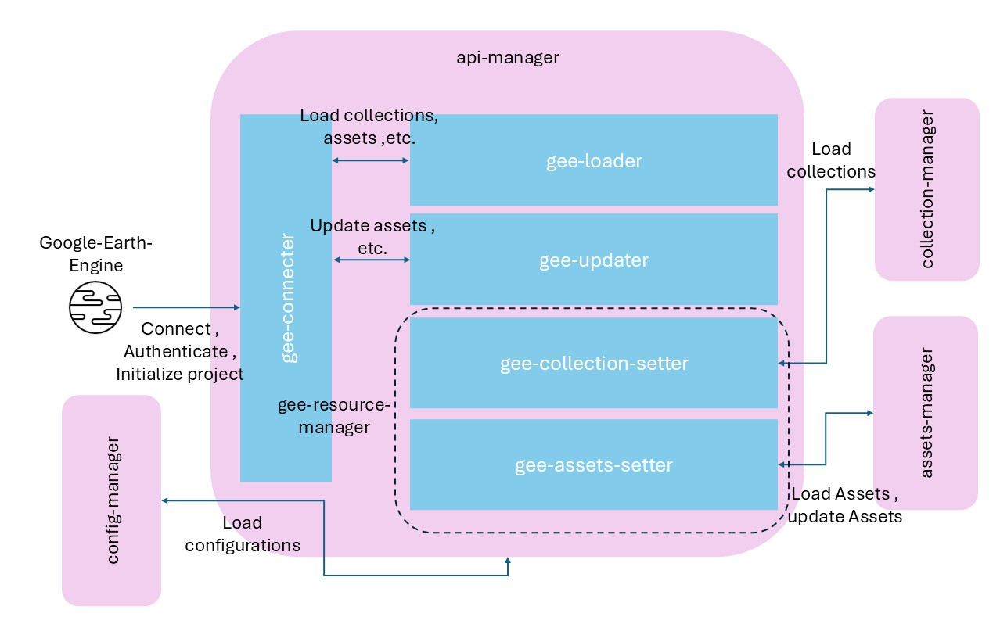
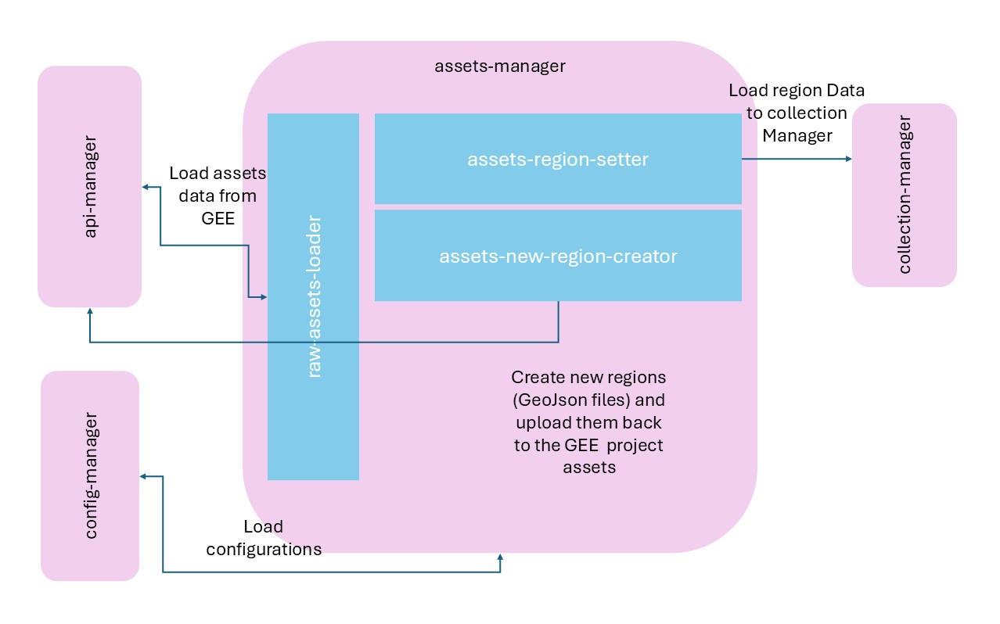
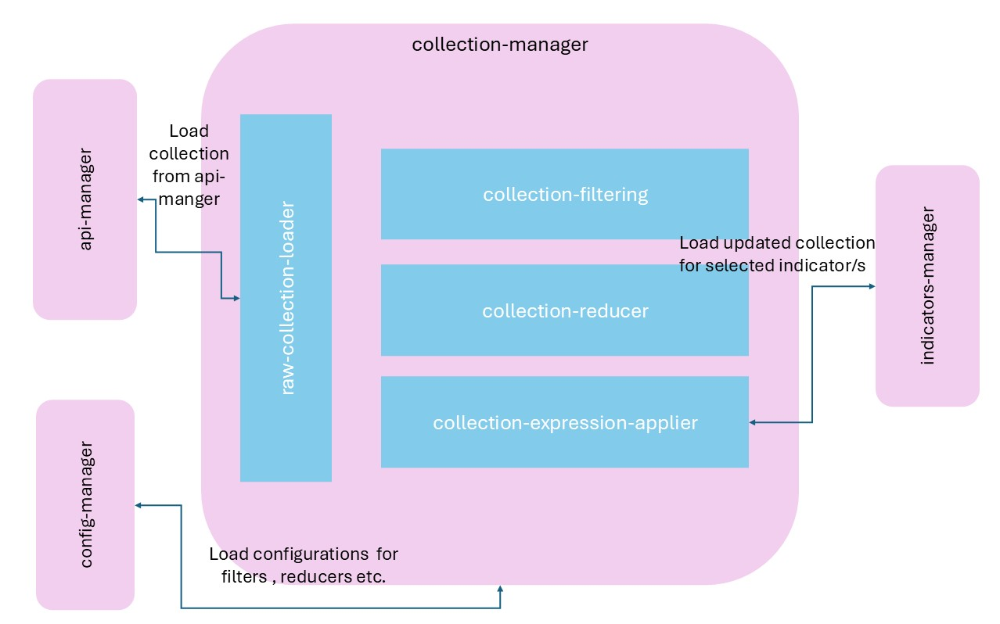
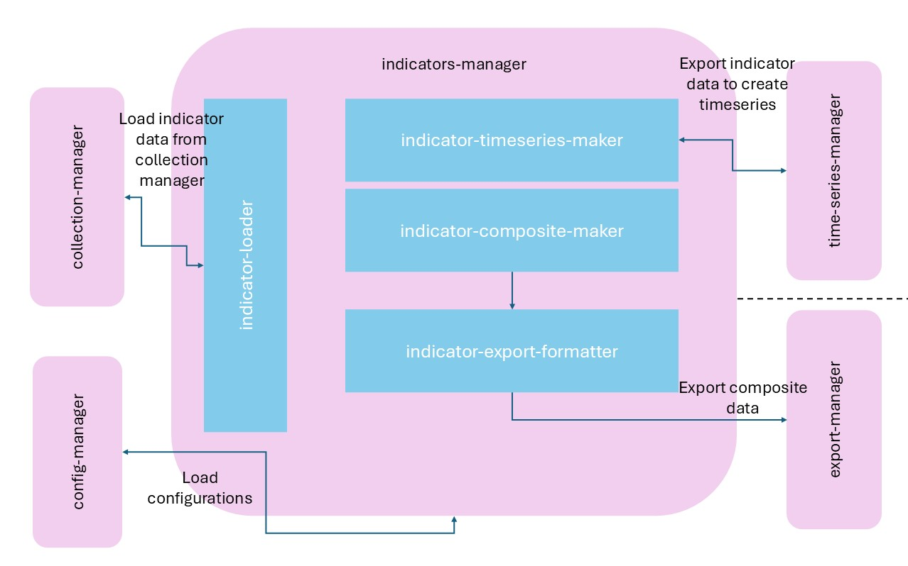
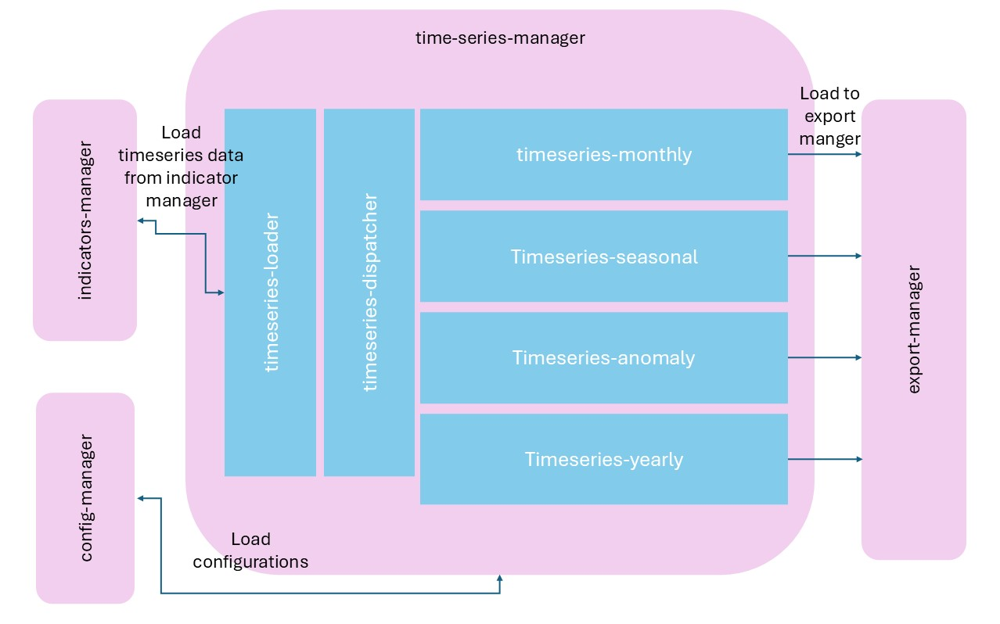
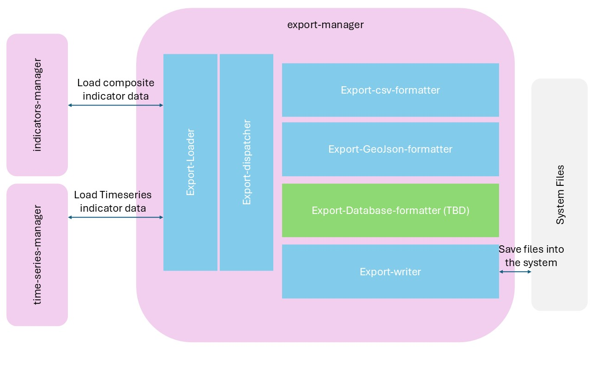
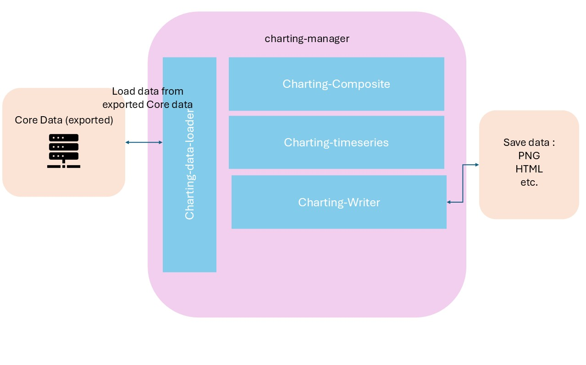
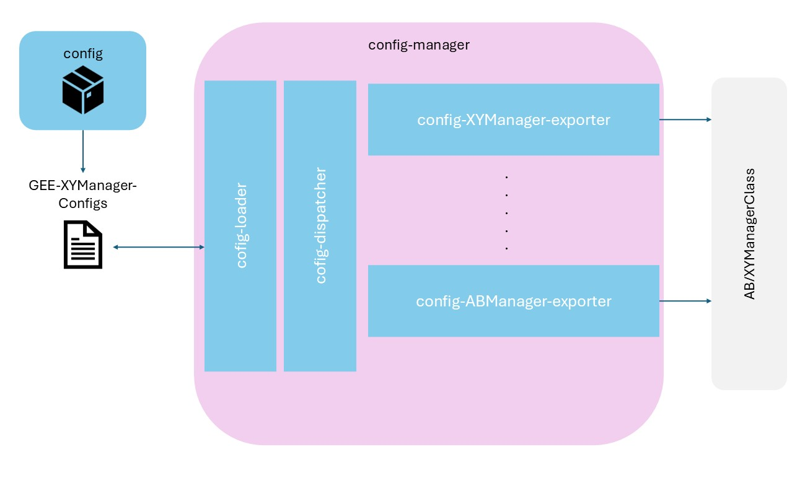

# SGRD Data Acquisition
A modular framework to acquire, process, and visualize Earth observation indicators (e.g. NDVI, rainfall, temperature ,see [Initial_Data_collection](/Data/Initial_Data_collection.md) for more information on indicators, regions , time series) for agricultural and environmental analysis in eastern Syria and other ares (TBD).

## Index
- [SGRD Data Acquisition](#sgrd-data-acquisition)
  - [Index](#index)
  - [Requirements](#requirements)
  - [Introduction](#introduction)
  - [Architecture Documentation](#architecture-documentation)
    - [📌 System Overview](#-system-overview)
    - [1. 🌐 API Manager (api-manager)](#1--api-manager-api-manager)
      - [Role:](#role)
      - [Key Modules:](#key-modules)
  - [](#)
    - [2. 🗺️ Assets Manager (`assets-manager`)](#2-️-assets-manager-assets-manager)
      - [Role:](#role-1)
      - [Key Modules:](#key-modules-1)
  - [](#-1)
    - [3. 📦 Collection Manager (`collection-manager`)](#3--collection-manager-collection-manager)
      - [Role:](#role-2)
      - [Key Modules:](#key-modules-2)
  - [](#-2)
    - [4. 🌿 Indicators Manager (`indicators-manager`)](#4--indicators-manager-indicators-manager)
      - [Role:](#role-3)
      - [Key Modules:](#key-modules-3)
  - [](#-3)
    - [5. ⏱️ Time Series Manager (`time-series-manager`)](#5-️-time-series-manager-time-series-manager)
      - [Role:](#role-4)
      - [Key Modules:](#key-modules-4)
  - [](#-4)
    - [6. 📤 Export Manager (`export-manager`)](#6--export-manager-export-manager)
      - [Role:](#role-5)
      - [Key Modules:](#key-modules-5)
  - [](#-5)
    - [7. 📊 Charting Manager (`charting-manager`)](#7--charting-manager-charting-manager)
      - [Role:](#role-6)
      - [Key Modules:](#key-modules-6)
  - [](#-6)
    - [8. ⚙️ Config Manager (`config-manager`)](#8-️-config-manager-config-manager)
      - [Role:](#role-7)
      - [Key Modules:](#key-modules-7)
  - [Workflow](#workflow)
  - [Setup and usage](#setup-and-usage)

## Requirements
| Requirement| version | Note
|------------|---------|-----|
|Python | 3.10+ |n/a|
|Earth Engine Python API| latest|n/a|

## Introduction
This project supports data-driven analysis for sustainable agriculture, land monitoring, and climate resilience, in support of SGRD’s objectives. It uses Google Earth Engine, Python, and modular tools to extract multi-year satellite-based indicators.

## Architecture Documentation
### 📌 System Overview

The SGRD Data Acquisition system is organized into modular environments with separation of core runtime, testing, and patching functionality. Below is the high-level architecture


``` shell
SGRD Data Acquisition
├── SGRD_venv
│   ├── config/          # Configuration loaders and exporters
│   ├── core/            # Modular core logic (managers)
│   ├── scripts/         # Automation and orchestration scripts
│   └── ui/              # (To be developed) UI interfaces
│   └── requirements.txt # Dependencies for the environment
│
├── SGRD_test.venv
│   └── tests/           # Unit and integration tests
│
└── cli-patch            # CLI scripts for patching, maintenance, etc.
```

### 1. 🌐 API Manager (api-manager)
#### Role:
Handles all interactions with Google Earth Engine (GEE), including authentication, asset loading, and collection management.

#### Key Modules:
- **gee-connector**: Authenticates and initializes GEE.
- **gee-loader**: Loads collections and assets.
- **gee-resource-manager**: Sets metadata or uploads new assets (e.g. shapefiles).


---
### 2. 🗺️ Assets Manager (`assets-manager`)
#### Role:
Manages spatial regions and AOI definitions, including creation, tagging, and validation.

#### Key Modules:
- **raw-assets-loader**: Loads geometry or feature collections from GEE.
- **region-setter**: Assigns metadata (e.g. tags, sector names).
- **region-creator**: Allows creation of new AOIs and uploads to GEE.


---
### 3. 📦 Collection Manager (`collection-manager`)
#### Role:
Manages the transformation of Earth Engine image collections into indicator-ready datasets.

#### Key Modules:
- **raw-collection-loader**: Loads image collections based on configs.
- **collection-filtering**: Filters data by time, space, or clouds.
- **collection-reducer**: Aggregates time-series (e.g. monthly, yearly).
- **collection-formula-mapper**: Applies indicator formulas (e.g., NDVI).


---

### 4. 🌿 Indicators Manager (`indicators-manager`)
#### Role:
Transforms processed image collections into structured, exportable indicators.

#### Key Modules:
- **indicator-loader**: Accepts filtered & mapped image collections.
- **indicator-timeseries-maker**: Builds temporal representations (monthly, seasonal).
- **indicator-composite-maker**: Produces annual/seasonal spatial composites.
- **indicator-export-structurer**: Prepares output for export.


---
### 5. ⏱️ Time Series Manager (`time-series-manager`)
#### Role:
Handles specialized temporal processing and analysis of indicators.

#### Key Modules:
- **timeseries-loader**: Accepts input from indicators.
- **timeseries-dispatcher**: Selects appropriate transformation logic.
- **monthly / seasonal / anomaly / yearly**: Processing strategies for each.


---

### 6. 📤 Export Manager (`export-manager`)
#### Role:
Formats and saves processed outputs to disk, databases, or the cloud.

#### Key Modules:
- **export-loader**: Receives structured indicator data.
- **export-dispatcher**: Determines target format.
- **formatters**:
  - `csv-formatter`
  - `geojson-formatter`
  - `database-formatter`
- **export-writer**: Writes final output files.


---

### 7. 📊 Charting Manager (`charting-manager`)
#### Role:
Visualizes exported data as time series or composites.

#### Key Modules:
- **charting-data-loader**: Loads from structured outputs.
- **charting-timeseries**: Line charts of indicators.
- **charting-composite**: Spatial snapshot/summary visuals.
- **charting-writer**: Saves charts as PNG, HTML, etc.

---
### 8. ⚙️ Config Manager (`config-manager`)
#### Role:
Manages all configurations, decoupling parameters from logic.

#### Key Modules:
- **config-loader**: Loads the main config file.
- **config-dispatcher**: Routes config blocks to specific modules.
- **config-XYManager-exporters**: Per-manager exporters to normalize and validate configs.



---

## Workflow 

## Setup and usage

